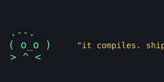

welcome to the blog. it exists now. that's the whole news.

i built this to dump writeups, project notes, and half-formed opinions somewhere
that isn't a locked drafts folder. expect CTF writeups, things i broke, and the
occasional rant.

## how posts work

every post is a folder under `posts/`. images live **right next to** the markdown:



no `/assets/` path juggling. drop the file in the folder, reference it by name,
done.

## code looks like this

```js
function ship(code) {
  if (code.compiles) return "good enough";
  return ship(code); // it'll be fine
}
```

that's it. see you in the next one.
